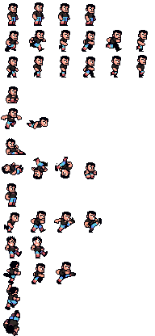

 

# Soccer Course | Project Touchstone #
[Tutorial: Create a Soccer Game in Godot](https://youtube.com/playlist?list=PLNNbuBNHHbNEEQJE5od1dyNE_pqIANIww&si=N_rNExMx6H_undIZ) by [The GameDev Tavern](https://gadgaming.itch.io/) ([YouTube](https://www.youtube.com/@GameDevTavern))

This multipart tutorial is a structured, follow-along project that guides the development of a multiplayer 2D pixel-art soccer game, demonstrating how to implement player movement, input handling, ball control, collision interactions, scoring mechanics, and various animations in the Godot Engine to create a functional competitive gameplay experience. It also served as the foundation for completing a structured implementation task on Feather, integrating the project into a broader development workflow supporting the Handshake AI Project Touchstone initiative.

# Assets #
[Soccer Course Assets](https://github.com/nicolasbize/soccer-course-assets/blob/main/assets.zip) by [The GameDev Tavern](https://nicolasbize.com/blog/) ([GitHub](https://github.com/nicolasbize))

# Create a Godot task #
<ins> What application is this task for? </ins>
 
Godot

### **Task prompt** ###
First, enter the **task prompt** and any relevant reference files (e.g., docs, diagrams, sketches, photos, schematics).

Tasks should sound like what a manager might give a skilled but junior employee: high-level guidance with some leeway on executional details, but with very clear success metrics. What a good outcome looks like must be very clear and easy to understand.

Include any relevant **reference files** (docs, diagrams, sketches, photos, schematics, etc) needed for someone to complete this task.

Reminder on the difference between reference and starting state files:
- **Reference files**: anything the Employee should look at or read while completing the project that does not need to be directly loaded into the application (*'please make something that looks like XYZ image'*)
- **Starting state files (upload below)**: anything that the Employee would need to load into their workspace to complete the task (*'here is the existing file you should adapt'*)

<ins> Task prompt (ask the Employee) </ins>
 
We are beginning development for the player controller, physics, and mechanics of a new 2D pixel-art soccer game prototype. Your task is to develop responsive player movement, ball control, and an interaction system, using pixelated soccer player sprites, creating a reliable set of core mechanics that support consistent gameplay. The system should emphasize reliable control by using keyboard input handling, responsive ball physics, and a camera system that consistently tracks gameplay from a side-scrolling perspective. All visual assets, including the player sprites, soccer ball, and field environment, should render sharply and clearly without distortion, preserving the visual clarity expected in a pixel-art style. You will set up the necessary nodes, apply the soccer player sprites, and configure collision and physics properties to ensure proper interaction with the soccer ball and field environment. The camera should follow the player characters smoothly during gameplay, ensuring they remain visible and properly framed at all times. Player characters must always face the correct direction when moving or interacting with the ball, with smooth animations that clearly convey motion and kicking actions. The system should support controlled dribbling, passing, and kicking mechanics, with realistic ball movement influenced by physics and gravity. The movement system should support the following abilities:

- Player 1 uses the arrow keys for full directional movement.
- Player 2 uses the WASD keys for full directional movement.
- Player 1 can kick the ball when pressing the right bracket key.
- Player 2 can kick the soccer ball when pressing the number 1 key.
- The soccer players can dribble a yellow soccer ball while moving.
- Holding the kick input increases shot power and travel distance.
- Teammates can pass the soccer ball to each other through kicks.
- The players can kick the ball at different trajectories and distances.

Vertical motion should behave consistently, with gravity producing a natural downward pull and the soccer ball bouncing realistically after being kicked and landing. The soccer players should be able to kick the ball at different trajectories and distances based on timing and directional input. Interactions with the environment must be stable and precise, allowing players and the ball to move seamlessly across the field, respond accurately to boundaries, and maintain proper positioning without unintended overlap or clipping. The soccer field environment should include walkable ground areas, clear boundary markings, and open space suitable for movement and passing interactions. The camera should follow gameplay action smoothly while maintaining a consistent view of both players and the ball, ensuring clarity during running movement. Overall behavior should demonstrate tight responsiveness, smooth transitions between movement and ball control, and a level of polish that supports further development of the soccer gameplay system.

<ins> Which of the following best fits this task? </ins>
 
Task from scratch

<ins> How long would you anticipate an 'Employee' to complete this task? (in hours) </ins>
 
3

### **Starting state** ###
Please describe and include below any information about the starting state of this project:
- Existing work to be modified
- Other assets or other inputs the Employee needs to bring to be able to complete this task

Reminder on the difference between the starting state and the reference files:
- **Starting state files**: anything that the Employee would need to load into their workspace to complete the task ('*here is the existing file you should adapt*')
- **Reference files (upload above)**: anything the Employee should look at or read while completing the project that does not need to be directly loaded into the application ('*please make something that looks like XYZ image*')

<ins> Starting state description </ins>
 
The starting state for this task consists of a newly created 2D Godot project that provides the essential assets and minimal setup required to begin development of this pixel-art soccer game. The project includes imported sprite sheets for multiple soccer players with matching team uniforms, along with a soccer ball asset to support movement, passing, dribbling, and kicking interactions. It also contains a basic field layout and visual elements to represent a playable soccer environment suitable for gameplay testing. The Employee is responsible for constructing the soccer game using the provided assets, setting up player scenes with appropriate nodes and collision shapes, and organizing the project structure with folders for assets, scenes, scripts, and resources. The Employee must implement player movement, ball control mechanics, all animations using the sprite sheets, and camera behavior. This task includes defining input actions, attaching scripts, configuring physics interactions between players and the ball, and ensuring responsive and consistent gameplay behavior. The reference materials illustrate how to use the provided assets to build a cohesive soccer game that supports fluid player control, ball interaction, and overall multiplayer functionality.

### **Overall context** ###
Finally, include context on this task and why it is realistic and representative of real-life work:
- Why is this a reasonable task for a manager to ask a junior-level employee to do?
- Is there a larger project it might be a part of?

<ins> Task context </ins>
 
This task is a realistic and representative assignment for a junior-level developer, as it focuses on implementing core player movement and ball interactions to create a multiplayer soccer game. It requires applying foundational programming, mathematical solving, and design skills to translate gameplay requirements into functional systems, such as player control, ball physics, dribbling, kicking, trajectories, collision handling, and camera behavior. These are common responsibilities in sports game development, with clear success criteria tied to responsiveness, realism, and smooth interaction between players and the ball. The task reflects real-world workflows, where developers build on an existing project setup, organize assets and scenes, and implement features in a modular and extensible manner. It emphasizes integrating multiple systems, including multiplayer input handling, motion physics, and animation into a cohesive gameplay experience typical of early-stage development. This task could be part of a larger soccer game project, where these foundational mechanics serve as the basis for future features such as passing systems, CPU teammates and opponents, scoring mechanics, UI elements, and match flow. Completing this task ensures that the core interaction between players and the ball is functional and reliable, providing a strong foundation for further iteration and expansion.

<ins> Rubric Items </ins>
 
1. The characters, level background, and level props all appear sharp.
- Run the main scene and observe that all character sprites, level background, and environment props appear sharp and clear.
- The task prompt requires that all character sprites, level background, and level props remain visually sharp and clear.

2. The character sprites are male soccer players with matching uniforms.
- Run the main scene and observe that the character sprites appear as male soccer players wearing matching uniforms.
- The task prompt requires that all character sprites appear as male soccer players who are wearing matching team attire.

3. The level background is a soccer field with green grass and white lines.
- Run the main scene and observe that the level background displays a soccer field with green grass and visible white boundary lines.
- The task prompt requires that the level background represent a soccer field with green grass and have white field markings.

4. The animations play smoothly and always face the correct direction.
- Run the main scene and move the player characters to observe smooth animation transitions and the correct facing direction.
- The task prompt requires that all character sprite animations play smoothly while facing the correct orientation and when moving.

5. The gravity produces realistic and consistent motion for a soccer game.
- Run the main scene and interact with the soccer ball to observe controlled dribbling, responsive kicks, and natural ball bounces.
- The task prompt requires gravity to support physics for kicking trajectories, realistic bounces, and accurate dribbling when moving.

6. The player characters can properly collide with the ground and the ball.
- Run the main scene and move the player characters across the field to confirm they collide with the background and the soccer ball.
- The task prompt requires functional collision bodies for the player characters to interact correctly with all level environment elements.

7. The camera displays the player characters accurately during gameplay.
- Run the main scene and move the sprites across the soccer field to confirm that the game camera accurately displays the characters.
- The task prompt requires accurate camera tracking to maintain a consistent view of the player characters throughout gameplay.

8. Player 1 moves with the arrow keys and stops when input is released.
- Run the scene, use the arrow keys to move the first player in all directions, and then release the input to confirm it stops instantly.
- The task prompt requires the arrow keys for full directional movement, and the first player must stop when releasing input.

9. Player 2 moves with the WASD keys and stops when input is released.
- Run the scene, use the WASD keys to move the second player in all directions, and then release the input to confirm it stops instantly.
- The task prompt requires the WASD keys for full directional movement, and the second player must stop when releasing input.

10. Player 1 can kick the ball upward when pressing the right bracket key.
- Run the main scene, control the ball with the first player, and press the right bracket key to confirm the soccer ball gets kicked upward.
- The task prompt requires the first player to execute an upward kick by pressing the right bracket key for gameplay.

11. Player 2 can kick the ball upward when pressing the number one key.
- Run the main scene, control the ball with the second player, and then press the 1 key to confirm the soccer ball gets kicked upward.
- The task prompt requires the second player to execute an upward kick by pressing the number one key for gameplay.

12. The player characters can dribble a yellow soccer ball with black dots.
- Run the main scene and then move the first player while interacting with the yellow soccer ball to observe controlled dribbling.
- The task prompt requires dribbling mechanics that allow the player characters to maintain control of the soccer ball when moving.

13. The characters can pass the soccer ball to teammates when kicking it.
- Run the main scene and kick the soccer ball between players to confirm successful passing interactions between teammates.
- The task prompt requires passing mechanics that allow accurate ball transfer between player characters during gameplay.

14. Holding the kick button allows players to shoot the soccer ball farther.
- Run the main scene, hold the kick input, and then release it to observe increased shot power and longer travel distance.
- The task prompt requires charge-based kicking to increase shot strength and travel distance when holding the kick input.

15. The player characters can kick the soccer ball at different trajectories.
- Run the main scene, change the input timing and direction each time to observe different soccer ball trajectories when kicking.
- The task prompt requires dynamic kick physics that produce varied ball arcs and distances based on input duration and direction.
 
Godot - https://feather.openai.com/tasks/693aab61-df9b-437e-9be8-64b9bc064a9a/stage/prompt_creation - Awaiting response.
